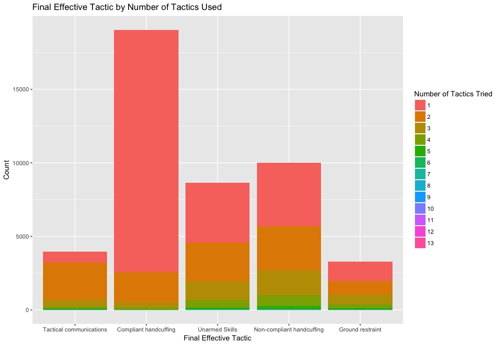

# Comparitive Analysis of UK and US Use of Force Incidents

## Available Data

The results presented here are harvested from the London Metropolitan Police Department use of force database available at the [London Datastore](https://data.london.gov.uk/dataset/use-of-force). Many columns were copied directly from the table while others (such as location and subject behavior) were filled in using several columns of data from the original database. Data on the perceived well-being of each borough as well as their actual crime rates was also downloaded from the Datastore and added to the main data frame *(final size: 75mb including over 55,000 incidents from April 2017 to Feb 2018)*. 

In the US, [the FBI will be releasing](https://ucr.fbi.gov/use-of-force) data semi-annually following the conclusion of their pilot study. Once this data is released, similar analysis will be conducted to compare patterns of behavior between London and a major US city. 

## Objectives
Both the US and the UK have recently seen large-scale protests in response to incidents of police brutality, particularly involving black citizens as the targets. After the first round of the London Met database was published, it was widely reported that a disproportionate amount of these use of force incidents involved black citizens. While only making up 13% of the city's population, [they were the subject of 36% of the incidents](https://www.theguardian.com/uk-news/2017/aug/01/met-police-using-force-against-disproportionately-large-number-of-black-people).  
The creation and release of these incident databases has actually been, in part, an attempt to determine whether these incidents are outliers or results of systematic bias. My analysis will be able to show which factors are the most important in the conscious and unconscious decision to use escalating levels of force. I will then be able to compare this observed decision making process between officers in the UK who do not commonly carry firearms and those in the US who do. 

## Exploratory Models and Plots
OOB Error Rate: 37.04%  
Figure 1: Relative importance of predictors     
 
**Top 10 Important Factors for Final Attempted Tactic**
1. Subject's Behavior
2. Number of Tactics Attempted
3. Relative Location
4. Officer's Main Duty
5. Borough
6. Attempting to Arrest Subject
7. Borough Unemployment Rate
8. Number of Deliberate Fires in Borough
9. Attempting to Search Subject
10. Borough Subjective Well Being Score  

## View histogram of responses broken up by the factor levels of the two most important predictors

Figure 2A:   
  
Can see that, in cases where unarmed skills or more serious responses are used, aggressive and serious or aggravated resistance on the part of the subject is present. This confirms the level of force is somewhat proportional to the subject's behavior.   

Figure 2B:   
  

Can see, by the presence of more green in the later bars representing more forceful tactics, that more responses are tried before resorting to a more extreme tactic than a less extreme one. In other words, less extreme tactics are tried first instead of immediately jumping to the level of force the subject is exhibiting. This would be in keeping with the [National Decision Model](https://www.app.college.police.uk/app-content/national-decision-model/the-national-decision-model/) taught at police academies in the country. 

## Thoughts from Preliminary Analysis
1. As expected, subject's behavior is the most important factor with other tactics being tried before resorting to force.
2. Subject's percieved ethnicity did not come up in the 30 most important factors. 
3. However location and borough were in the top 10, suggesting where the incident takes place is important.
4. Factors relating to both the "percieved neighborhood quality" (subjective well-being score) and the "actual neighborhood quality" (borough unemployment rate and arson crimes) scored in the top 10 as well.  

**Hypothesis:**  
The racial skew in targets is not the result of direct racism but possible profiling by neighborhood. 

## Subsequent Analysis
**Evaluating other response variables**  
Figure 3A *(OOB Error Rate: 5.26%)*:  
 
Figure 3A.i:  
 
Figure 3A.ii:  
 

Figure 3B *(OOB Error Rate: 29.33%)*:  
 
Figure 3C *(OOB Error Rate: 17.34%)*:  
 

## Additional Reading
* [Toward a Theory of Race, Crime, and Urban Inequality](https://books.google.co.uk/books?hl=en&lr=&id=tV6MAQAAQBAJ&oi=fnd&pg=PA177&dq=Toward+a+Theory+of+Race,+Crime,+and+Urban+Inequality&ots=ErFKtjljan&sig=Ecnv8bpTfbCVtn4Fejx9NrzF9gw#v=onepage&q=Toward%20a%20Theory%20of%20Race%2C%20Crime%2C%20and%20Urban%20Inequality&f=false)
* [Policing Ethnic Minority Communities](http://eprints.lse.ac.uk/9576/1/Policing_ethnic_minority_communities_(LSERO).pdf)
