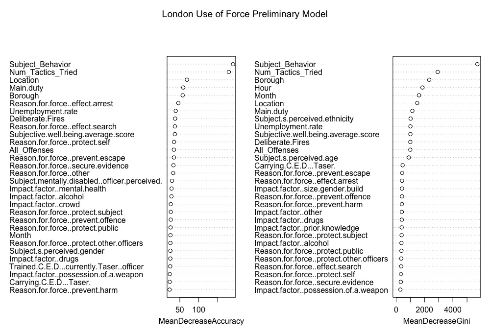

## Collect and Collate Data

The main dataframe is harvested from the London Metropolitan Police Department use of force database available at Londa Datastore. Many columns were copied directly from the table while others (such as location and subject behavior) were filled in using several columns of data from the original database. 

```{r}
#Read in main database
idents<-read.csv("Use_ofForce.csv",header=T)
BaseDF<-data.frame(Date=incidents[,1])
#Create column for month (with 13 and 14 representing January and February 2018)
BaseDF$Month<-as.numeric(regmatches(incidents$Incident.date..dd.mm.yy.,regexpr("\\d*",incidents$Incident.date..dd.mm.yy.)))
BaseDF$Month[BaseDF$Month=="1"]<-"13"
BaseDF$Month[BaseDF$Month=="2"]<-"14"
#Create column for hour of the day (0-24)
BaseDF$Hour<-regmatches(incidents$Incident.time..hh.mm.,regexpr("\\d*",incidents$Incident.time..hh.mm.))
BaseDF$Borough<-incidents$LPA.BCU.OPU..UoF.carried.out
#Description of location
BaseDF$Location<-NA
for (i in 1:nrow(incidents)){
  for (j in 3:17){
    if (incidents[i,j]=="Yes"){
      fullLoc<-colnames(incidents)[j]
      BaseDF$Location[i]<-substring(fullLoc, 20)
    }
  }
}
BaseDF$Subject_Behavior<-incidents$Primary..conduct.of.subject...behaviour
#Column for threat or assault
BaseDF$Threat_orAssault<-NA
for (i in 1:nrow(incidents)){
  for (j in 20:22){
    if (incidents[i,j]=="Yes"){
      BaseDF$Threat_orAssault[i]<-colnames(incidents)[j]
    }
  }
}
BaseDF[,8:33]<-incidents[,23:48]
#Create column of the last effective tactic used
BaseDF$Final_Effective_Tactic<-NA
for (i in 1:nrow(incidents)){
  for (j in seq(from=88,to=50,by=-2)){
    if (incidents[i,j]=="Yes"){
      BaseDF$Final_Effective_Tactic[i]<-as.character(incidents[i,j-1])
    }
  }
}
#Create column for total number of tactics used
BaseDF$Num_Tactics_Tried<-NA
for (i in 1:nrow(incidents)){
  counter<-0
  for (j in seq(from=50,to=88,by=2)){
    if (as.character(incidents[i,j])!="NULL"){
      counter<-counter+1
    }
  }
  BaseDF$Num_Tactics_Tried[i]<-counter
}
BaseDF[,36:54]<-incidents[,253:271]
```

## Add in Demographic Data 

Read in data from additional data sources on London Datastore. This included data about the crime rate, the social cohesion of the area, and the perception of wellbeing. 

```{r}
#Add in demographic info by borough
crimeRateDF<-read.csv("crime_rate.csv",header = TRUE, stringsAsFactors = FALSE)
FullDF<-merge(BaseDF,crimeRateDF, all.x = TRUE,by="Borough")

#Add in wellbeing data
wellbeingDF<-read.csv("wellbeing.csv",header=TRUE, stringsAsFactors = FALSE) 
collapse_wellbeing<-aggregate(wellbeingDF[colnames(wellbeingDF)[5:16]], by = list(wellbeingDF$Borough), FUN = "sum")
colnames(collapse_wellbeing)[1]<-"Borough"
FullDF<-merge(FullDF,collapse_wellbeing, all.x = TRUE,by="Borough")

#social metrics
socialDF<-read.csv("social_metrics.csv", stringsAsFactors = FALSE)
FullDF<-merge(FullDF,socialDF, all.x = TRUE,by="Borough")
```

## Fit Initial Random Forest
```{r}
library(randomForest)
#Subset full database for preliminary model exploration
ModelDF<-FullDF$Final_Effective_Tactic
ModelDF<-cbind(ModelDF,FullDF[,c(1,3:6, 8:33,35:40,55,68,70,76)])
subModelDF<-droplevels(na.omit(ModelDF))
colnames(subModelDF)[1]<-"Final_Effective_Tactic"
subsetTactics<-data.frame(sort(table(subModelDF$Final_Effective_Tactic),decreasing=TRUE)[1:5])
subModelDF<-droplevels(subModelDF[subModelDF$Final_Effective_Tactic %in% subsetTactics$Var1,])
subModelDF$Month<-as.numeric(as.character(subModelDF$Month))
subModelDF$Hour<-as.numeric(as.character(subModelDF$Hour))
subModelDF$Location<-as.factor(subModelDF$Location)
subModelDF$All_Offenses<-as.numeric(as.character(subModelDF$All_Offenses))
#Fit model
ranFor1<-randomForest(x=subModelDF[,2:42],y=subModelDF[,1],importance=TRUE,ntree=500)
print(ranFor1)


```

Figure 1: Relative importance of predictors  
 
## View histogram of responses broken up by the factor levels of the two most important predictors
```{r}
library(ggplot2)
subModelDF<-within(subModelDF, 
                   Final_Effective_Tactic<-factor(Final_Effective_Tactic, 
                                      levels=c("Tactical communications","Unarmed Skills","Compliant handcuffing", "Non-compliant handcuffing","Ground restraint")))


ggplot(subModelDF, aes(x=Final_Effective_Tactic, fill=Subject_Behavior)) +
  geom_histogram(stat="count") + xlab("Final Effective Tactic") + ylab("Count") + scale_fill_discrete(name = "Subject Behavior") + ggtitle("Final Effective Tactic by Subject Behavior")
ggplot(subModelDF, aes(x=Final_Effective_Tactic, fill=as.factor(Num_Tactics_Tried))) +
  geom_histogram(stat="count") + xlab("Final Effective Tactic") + ylab("Count") + scale_fill_discrete(name = "Number of Tactics Tried") + ggtitle("Final Effective Tactic by Number of Tactics Used")
```

Figure 2A:   
 
Figure 2B:   
 
